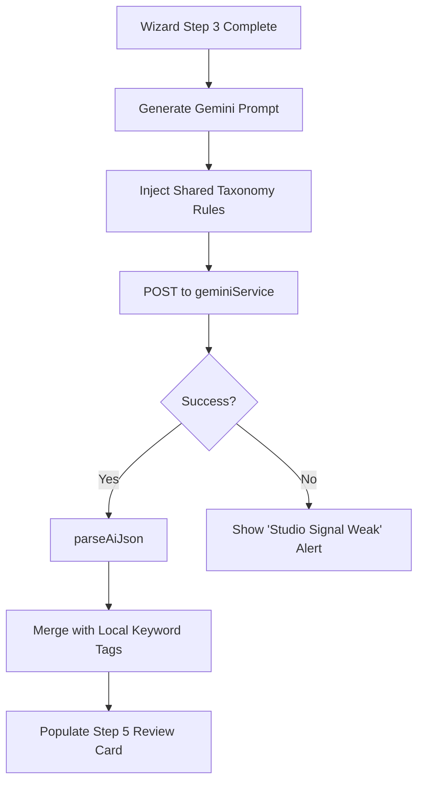

# Developer Guide: AI Studio Core Ready Reckoner

This guide serves as the foundational technical reference for the **FUZO AI Studio Pattern** — the standardized architecture used by Snap, Bites, and Trims to handle immersive data creation and neural synthesis.

---

## 🏗️ Technical Root
The shared logic lives in the `shared` layer to prevent duplication across features.

- **Central Utility**: `src/shared/lib/studioHelpers.ts`
- **Neural Bridge**: `src/services/geminiService.ts`
- **Taxonomy Engine**: `src/shared/utils/taxonomy.ts`
- **Metadata Logic**: `src/shared/lib/metadata.ts`

---

## 🧭 The 7-Step Wizard Pattern

All immersive studios (Snap, Bites, Trims) follow a consistent 0-6 index state machine. Use this pattern for any new creation features.

| Step | State Role | Interaction logic |
| :---: | :--- | :--- |
| **0** | **Source Selection** | Hardware access (Camera) or filesystem (Upload). |
| **1** | **Geospatial / Discovery** | Google Maps placement or YouTube URL parsing. |
| **2** | **Identity Mapping** | Primary categorisation (Cuisine, Restaurant Name). |
| **3** | **Human Context** | User description, ratings, or voice-to-text input. |
| **4** | **Neural Reveal** | Async processing window with deterministic "Glitch" animations. |
| **5** | **Result Review** | AI-generated card preview with granular edit overrides. |
| **6** | **Persistence** | Confirmation and multi-table database write. |

---

## 🧠 Shared Helper Architecture

### 1. Media Processing (`studioHelpers.ts`)
Standardizes the transformation of image/video blobs into base64 strings compatible with the Gemini API and React state previews.
- `readImageFileAsDataUrl(file)`: Robust `FileReader` wrapper.
- `loadUploadedImage(file, setter, nextStep)`: Orchestrates the transition from OS file pickers to the Studio UI.

### 2. Neural Parsing (`parseAiJson`)
A high-accuracy parser designed to handle the stochastic nature of LLM responses.
- **Fail-safe Logic**: Automatically extracts JSON from Markdown blocks (```json ... ```).
- **Fallback**: Uses a recursive balanced-bracket regex to salvage partial JSON objects from malformed strings.

### 3. Taxonomy Normalization (`taxonomy.ts`)
The "Kitchen Scale" of the app. It ensures that user-inputted strings like `italy` or `spicy` are consistently mapped to canonical tags like `Italian` or `Spicy`.
- **Keyword Map**: Regex-free substring search engine.
- **Normalizer**: Standardizes casing and whitespace for DB efficiency.

---

## 📡 Neural Synthesis Sequence



---

## 🛠️ Maintenance & Scaling

### Adding a New Studio Feature
1. **Copy the Pattern**: Use `SnapView.tsx` as the master template for the step-based state machine.
2. **Reuse Helpers**: Do not re-implement file reading or JSON parsing. Import from `@shared/lib/studioHelpers`.
3. **Extend Taxonomy**: If the new feature requires new categories (e.g., "Texture"), add them to the `TAXONOMY` constant in `taxonomy.ts`.

---

> [!IMPORTANT]
> **State Isolation**: Always keep `capturedImage` or `processedMedia` in the top-level Studio component. Do not pass setters deep into step components if possible; use callbacks instead.

> [!TIP]
> **Performance**: The `NeuralRevealStep` intentionally waits ~2500ms even if the API returns faster. This "Artifical Wait" allows the user to emotionally process that "AI Magic" is happening, improving perceived value.
