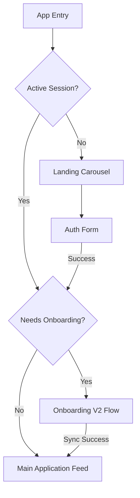

# Developer Guide: Authentication Ready Reckoner

This guide serves as the technical reference for the **FUZO Auth System** — the secure gatekeeper orchestrating user entry and cinematic transitions.

---

## 🏗️ Technical Root
The auth system is modularized within `src/features/auth/`.

- **Primary Orchestrator**: `src/features/auth/components/AuthOrchestrator.tsx`
- **Auth UI Core**: `src/features/auth/components/AuthView.tsx`
- **Persistence Service**: `src/features/auth/services/authService.ts`
- **OAuth Handler**: `src/features/auth/lib/oauthRedirect.ts`

---

## 🧭 Intelligence & Routing logic

The auth system uses a multi-layered detection engine to determine the user's destination:

### 1. The Onboarding Gatekeeper
Located in `AuthView.tsx`, the `userNeedsOnboarding` check determines if a user should proceed to the main feed or the 7-step onboarding wizard.
```tsx
const userNeedsOnboarding = (user: AuthUser): boolean => {
  const metadata = user?.user_metadata;
  // Fallback to multiple keys for legacy compatibility
  return !Boolean(metadata.onboarding_completed || metadata.has_completed_onboarding);
};
```

### 2. Entry Flow Pipeline
1. **Landing Check**: If no session, show `LandingView`.
2. **Auth Challenge**: User interacts with email/social login.
3. **Session Created**: `AuthOrchestrator` captures the event.
4. **Metadata Audit**: Logic checks for `onboarding_completed`.
5. **Resolution**: Redirect to `Feed` or `OnboardingV2Flow`.

---

## 🌳 Auth Orchestration Flow



---

## 🎨 Design & Motion
Auth follows the **Pitch Black / Canvas Stone** high-contrast system.

- **Background**: High-fidelity heritage image (`Unsplash`) with a `stone-950` to transparent gradient.
- **Motion**: Framer Motion `AnimatePresence` with `mode="wait"`. Form transitions use a 300ms spring for better perceived performance.
- **Glassmorphism**: Auth cards use `bg-white/80` with `backdrop-blur-xl` and `border-white/20`.

---

## 📡 Database & External Services
- **Supabase Auth**: Managing DMs, OAuth (Google), and Email/Pass validation.
- **Storage**: User profile images are fetched via Supabase Storage but triggered here for local preview during signup.

---

## 🛠️ Maintenance & Extensions

### Adding a Social Provider
1. Add the provider ID to `AuthProvider` type in `auth/types/auth.ts`.
2. Implement the provider button in `AuthView.tsx` using the `SocialButton` primitive.
3. Ensure the `getOAuthRedirectUrl()` lib is updated if using custom environments (Staging/Prod).

### Force Re-Onboarding
To force a user to re-onboard, use the Supabase SQL Editor:
```sql
UPDATE auth.users SET raw_user_meta_data = raw_user_meta_data || '{"onboarding_completed": false}' WHERE email = 'target@email.com';
```

---

> [!IMPORTANT]
> **State Integrity**: Never bypass the `AuthOrchestrator`. It is the only component trusted to handle session lifecycle events and cleanup post-signout.

> [!TIP]
> **Performance**: The Auth backgrounds are blurred via CSS (`blur-sm`) to keep the focus on the credentials while maintaining the cinematic aesthetic of the landing experience.
