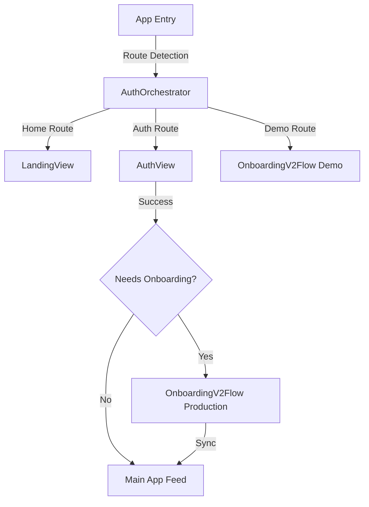

# Developer Guide: AuthView & Cinematic Entry

This guide details the architecture, logic, and visual integration of the `AuthView` component. This component serves as the gatekeeper for the FUZO V2 application, orchestrating the transition from unauthenticated state to the cinematic onboarding flow.

---

## 🏗️ Architecture Role

`AuthView` is the primary entry point for user identification. It handles both traditional email/password authentication and social OAuth providers.

- **Primary Orchestrator**: `k:\H DRIVE\Quantum Climb\APPS\FUZO_V2\src\features\auth\components\AuthOrchestrator.tsx`
- **Auth UI Component**: `k:\H DRIVE\Quantum Climb\APPS\FUZO_V2\src\features\auth\components\AuthView.tsx`
- **Dependencies**:
  - `AuthService`: Located in `../services/authService.ts`.
  - `OnboardingV2Flow`: Managed via the orchestrator.

---

## 🔑 Core Logic & Persistence

### 1. The Gatekeeper: `userNeedsOnboarding` (Line 53)
This function determines if a user should be redirected to the onboarding flow after a successful login.
```tsx
const userNeedsOnboarding = (user: AuthUser): boolean => {
  const metadata = user?.user_metadata;
  return !Boolean(metadata.onboarding_completed || metadata.has_completed_onboarding);
};
```
> [!IMPORTANT]
> **Metadata Reliability**: This check relies on the `onboarding_completed` flag in `user_metadata`. If you need to force a user to re-onboard, delete this key from their Supabase Auth metadata.

### 2. Authentication Pipeline (Line 71)
The `completeEmailAuth` function manages both `signin` and `signup` logic.
- **Sign In**: Checks for onboarding needs and resolves to the feed or the onboarding screen.
- **Sign Up**: Automatically transitions the session to the `onboarding` step (L94).

---

## 🎨 Cinematic Visual Heritage

The `AuthView` utilizes the same "Visual Heritage" design language as the landing page to ensure a seamless transition.

### 1. Motion Orchestration (Line 180)
Uses `AnimatePresence` with `mode="wait"` to ensure clean transitions between the "Welcome" screen and the Auth forms.

### 2. Background Backdrop (Line 165)
The backdrop is a high-fidelity image with a complex gradient overlay to ensure typographic legibility.
- **Image Source**: Unsplash (L168).
- **Styling**: `opacity-40 blur-sm` for a premium, unfocused aesthetic.
- **Overlay**: `bg-gradient-to-tr` from solid `stone-950` to transparent.

---

## 🌳 Authentication & Entry Flow
The application uses a layered entry logic: **Landing -> AuthOrchestrator -> AuthView -> Onboarding**.



---

## 🛠️ Maintenance Checklist

1.  **Changing the Backdrop**: Edit the `src` attribute in the `img` tag at **Line 168**. Ensure the image is high-aspect ratio (16:9 or taller).
2.  **Adding a Social Provider**:
    - Add the provider string to `AuthProvider` in `authService.ts`.
    - Add a new `SocialButton` in `AuthView.tsx` (Line 237).
3.  **Adjusting Transitions**: Modify the `initial`, `animate`, and `exit` props in the `motion.div` blocks (Line 182, 215).

---

> [!TIP]
> **Design Consistency**: Always match the `stone-950` background of `AuthView` with the `index.tsx` landing page background to prevent "color-shifting" flashes during the redirect process.
