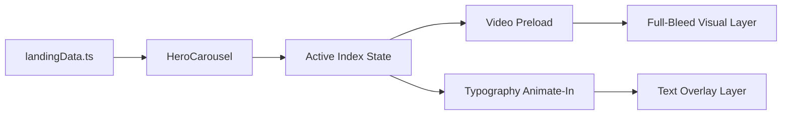

# Developer Guide: Cinematic Intro Ready Reckoner

This guide serves as the technical reference for the **FUZO Cinematic Intro** — the high-impact landing experience that introduces the AI Discovery Engine.

---

## 🏗️ Technical Root
The landing experience is modularized within `src/features/landing/`.

- **Main entry point**: `src/features/landing/components/LandingView.tsx`
- **Visual Engine**: `src/features/landing/components/HeroCarousel.tsx`
- **Content Map**: `src/features/landing/constants/landingData.ts`

---

## 🧭 Visual Engine Architecture

The Intro is built on a "Liquid Cross-Fade" system powered by **Framer Motion**.

### 1. The HeroCarousel
This component orchestrates the rotation of 6 feature slides. 
- **Timer**: 8000ms (8 seconds) per slide.
- **Motion**: Uses `AnimatePresence` without `mode="wait"` to allow simultaneous opacity cross-fades between the outgoing and incoming feature layers.

### 2. Content Sanitization
To maintain the "Elite" typographic look, the `landingData.ts` strings are processed to remove visual clutter:
- **No Commas**: Replaced with space or stylistic breaks.
- **Uppercase**: Enforced via global CSS tokens on all Intro headings.

---

## 🌳 Logic & Asset Pipeline

---

## 🎥 Media Management

The platform is 100% video-first. 
- **Location**: `/public/videos/`
- **Naming**: `video1.mp4` through `video6.mp4`.
- **Optimization**: To maintain high-fidelity performance, videos should be H.264 compressed and under 5MB each.
- **Looping**: All videos must have `autoPlay`, `muted`, and `loop` attributes enabled.

---

## 🛠️ Maintenance & Refinement

### Changing a Headline
Update the `LANDING_FEATURES` array in `landingData.ts`. The UI will automatically reflect the change on the next rotation.

### Adjusting Rotation Speed
The `setInterval` is managed within the `HeroCarousel` component. Adjust the `8000` value to speed up or slow down the cinematic tempo.

---

> [!IMPORTANT]
> **Constraint — No Hyphens**: Avoid using hyphens in titles or descriptions. They break the tracking-tight aesthetic on mobile devices.

> [!TIP]
> **Asset Heritage**: The `image` property in `landingData.ts` is rarely used in the carousel itself but acts as a persistent fallback for the Auth system background. Ensure they stay synchronized.
