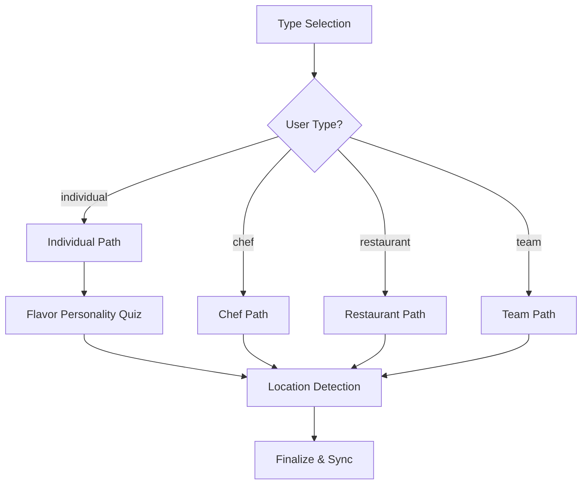

# Developer Guide: Multi-Path Onboarding System

This guide details the architecture, state management, and data persistence layer for the FUZO V2 "Visual Heritage" onboarding flow. Use this guide to understand how to extend the multi-path logic or debug the synchronization engine.

---

## 🏗️ Architecture & Entry Points

The onboarding system is decoupled into a presentation layer (`AuthView`) and a specific logic engine (`OnboardingV2Flow`).

### 1. The Trigger: `AuthView.tsx`
Onboarding is automatically triggered for new users or users with missing `onboarding_completed` flags.
- **Location**: `k:\H DRIVE\Quantum Climb\APPS\FUZO_V2\src\features\auth\components\AuthView.tsx`
- **Logic (Line 108)**:
  ```tsx
  if (useOnboardingV2) {
    return <OnboardingV2Flow onComplete={onComplete} />;
  }
  ```

### 2. The Engine: `OnboardingV2Flow.tsx`
This component manages the transition between user-type selection, dynamic branching paths, the personality quiz, and location detection.
- **Location**: `k:\H DRIVE\Quantum Climb\APPS\FUZO_V2\src\features\auth\components\OnboardingV2Flow.tsx`
- **Primary State (Line 37-44)**: Tracks `phase`, `userType`, `answers`, `quizAnswers`, `phone`, and `location`.

### 3. The Completion Handler: `index.tsx`
When onboarding ends, the payload is synchronized to both Auth Metadata (for immediate UI) and the Postgres database (for permanent profile settings).
- **Location**: `k:\H DRIVE\Quantum Climb\APPS\FUZO_V2\index.tsx`
- **Function (Line 4763)**: `const handleOnboardingComplete = async (payload?: OnboardingV2Payload)`

---

## 🌳 Multi-Path Logic Flow

The system uses a branching strategy defined in the `onboardingV2Data.ts` constants.



---

## 📝 Content & Question Management

To change the questions, options, or quiz logic, edit the constants in the following file:
- **File**: `k:\H DRIVE\Quantum Climb\APPS\FUZO_V2\src\features\auth\constants\onboardingV2Data.ts`

### Constants Mapping:
- **`ONBOARDING_USER_TYPES`**: The 4 main entry grids.
- **`INDIVIDUAL_PATH` / `CHEF_PATH` etc.**: Arrays of steps (`OnboardingV2Step`) defining the questions and choices for each branch.
- **`FOOD_PERSONALITY_QUIZ`**: The questions used to determine the user's "Culinary DNA."

---

## 💾 Database Integration

The onboarding flow targets the **`public.users`** table in Supabase.

### Target Columns:
| Column | Payload Mapping | Description |
| :--- | :--- | :--- |
| `profile_type` | `payload.userType` | Normalized (e.g. 'Individual', 'Chef'). |
| `profile_subtype` | `payload.quizResult` | The generated badge (e.g. 'Flavor Explorer 🌶'). |
| `cuisine_preferences` | `payload.answers.cuisines` | Array of strings (JSONB). |
| `dietary_preferences` | `payload.answers.dietary` | Array of strings (JSONB). |
| `onboarding_v2_metadata` | `payload` (Full) | Full raw JSON for future AI personalization. |

---

## 🧪 Testing & Debugging

### Direct Access
To test the flow without creating a new user, use the demo view:
- **URL**: `http://localhost:3000/app?view=onboarding-demo`
- **Implementation**: This view maps directly to the `OnboardingV2Flow` component in `index.tsx`.

### Resetting a User
To force a user back into onboarding for testing:
1. Open the Supabase SQL Editor.
2. Run:
   ```sql
   UPDATE public.users SET onboarding_completed = false WHERE username = 'YOUR_USERNAME';
   ```

---

## 🛠️ Maintenance Checklist

1.  **Adding a Question**: Add a new entry to the relevant path array in `onboardingV2Data.ts`. Ensure the `id` is unique.
2.  **Updating Backgrounds**: Edit the `ONBOARDING_BACKGROUNDS` constant in `OnboardingV2Flow.tsx` (Line 23).
3.  **Refining Quiz Logic**: The result calculation happens in the `finalize` function at **Line 76** of `OnboardingV2Flow.tsx`.

---

> [!IMPORTANT]
> **Data Consistency**: When adding new questions, ensure the `payload` fields in `index.tsx` are updated if you want the data to reach the `public.users` table columns. Otherwise, it will only be stored in the raw `onboarding_v2_metadata` JSON.
