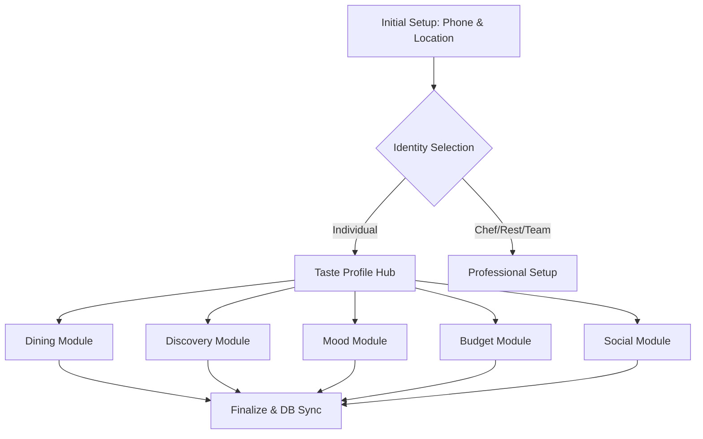

# Developer Guide: Onboarding Ready Reckoner

This guide serves as the technical reference for the **Multi-Path Onboarding System** — an immersive wizard designed to initialize the user's digital plate, culminating in the comprehensive 5-module Taste Profile Hub.

---

## 🏗️ Technical Root
The onboarding engine is modularized within `src/features/auth/`.

- **Main Orchestrator**: `src/features/auth/components/OnboardingV2Flow.tsx`
- **Content Map**: `src/features/auth/constants/onboardingV2Data.ts` (Legacy individual path elements)
- **Logic Trigger**: `src/features/auth/components/AuthOrchestrator.tsx`

---

## 🧭 System Architecture

The onboarding system operates on a "Dynamic Branching" model followed by a non-linear Hub.

### 1. The Initial Setup Phase
Before making any identity choices, the system immediately captures essential record-keeping data:
- **Phone Number** & **Location / Country of Origin**.
- This ensures critical data is captured early in case the user skips the remainder of the flow.

### 2. The Decision Engine
Users select from 4 primary categories (`Individual`, `Chef`, `Restaurant`, `Culinary Team`). This choice dictates the `path` sequence. Currently, the `Individual` path branches into the Taste Profile Hub.

### 3. The Taste Profile Hub
Replaced the old linear "Flavor Quiz" with a 5-module non-linear hub:
- **Dining**, **Discovery**, **Mood**, **Budget**, **Social** (5 questions each).
- Users can complete these modules in any order.
- The hub architecture aggregates the answers into a comprehensive `taste_profile` JSON object.

---

## 🌳 Logic & Flow Diagram

---

## 💾 Data Persistence (The Sync Layer)

Onboarding completion triggers a multi-field update to the `public.users` table in Supabase via the `AuthOrchestrator`.

| Supabase Column | Map Source | Description |
| :--- | :--- | :--- |
| `phone` | `payload.phone` | Contact number captured in Phase 1. |
| `location` | `payload.location` | Location string / origin. |
| `profile_type` | `payload.userType` | 'Individual', 'Chef', etc. |
| `onboarding_v2_metadata`| `payload.taste_profile`| JSONB object holding all 25 answers across the 5 modules. |
| `onboarding_completed`| `true` | Unlocks the main application. |

---

## 🛠️ Maintenance & Content Updates

### Modifying the Hub Modules
To add or change questions in the Taste Profile, update the `TASTE_PROFILE_MODULES` constant within `OnboardingV2Flow.tsx`. Ensure the keys in the module array map cleanly to the expected state objects.

---

> [!IMPORTANT]
> **Asset Integrity**: Onboarding background transitions are synchronized with the 2000ms "Visual Heritage" cross-fade. Ensure any custom images added to `ONBOARDING_BACKGROUNDS` are 1920x1080 or larger.

> [!TIP]
> **Location Fallback**: Geolocation and phone entry are now front-loaded. If the user decides to skip the Taste Profile hub later, the platform still retains their geographic baseline for discovery.
