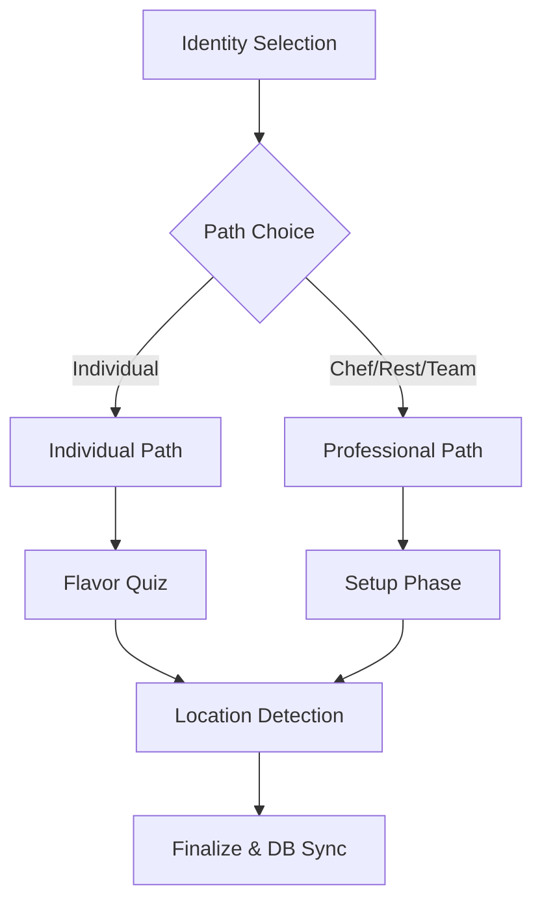

# Developer Guide: Onboarding Ready Reckoner

This guide serves as the technical reference for the **Multi-Path Onboarding System** — an immersive 7-step wizard designed to determine the user's culinary archetype and initialize their digital plate.

---

## 🏗️ Technical Root
The onboarding engine is modularized within `src/features/auth/`.

- **Main Orchestrator**: `src/features/auth/components/OnboardingV2Flow.tsx`
- **Content Map**: `src/features/auth/constants/onboardingV2Data.ts`
- **Logic Trigger**: `src/features/auth/components/AuthOrchestrator.tsx`

---

## 🧭 System Architecture

The onboarding system operates on a "Dynamic Branching" model. Users are funneled through different questions based on their initial identity selection.

### 1. The Decision Engine
Users select from 4 primary categories (`Individual`, `Chef`, `Restaurant`, `Culinary Team`). This choice dictates the `phase` sequence and the specific `OnboardingV2Step[]` array loaded from the constant map.

### 2. The Personality Quiz
The **Culinary DNA Quiz** is a shared module called towards the end of the `Individual` path. It uses weighted answers to assign a specialized badge (e.g., "Flavor Explorer 🌶").

---

## 🌳 Logic & Flow Diagram

---

## 💾 Data Persistence (The Sync Layer)

Onboarding completion triggers a multi-field update to the `public.users` table in Supabase via the `AuthOrchestrator`.

| Supabase Column | Map Source | Description |
| :--- | :--- | :--- |
| `profile_type` | `payload.userType` | 'Individual', 'Chef', etc. |
| `profile_subtype` | `payload.quizResult` | The generated badge title. |
| `cuisine_preferences`| `payload.answers.cuisines`| JSONB array of culinary tags. |
| `dietary_preferences`| `payload.answers.dietary` | JSONB array of restrictions. |
| `onboarding_completed`| `true` | Unlocks the main application. |

---

## 🛠️ Maintenance & Content Updates

### Adding a Step
1. Define the new step in `onboardingV2Data.ts` (e.g., in the `INDIVIDUAL_PATH` array).
2. Ensure the `id` property matches a valid field in the `OnboardingV2Payload` if data needs to be saved.

### Modifying the Quiz
To adjust the results for the Culinary DNA quiz, edit the `FINALIZATION` logic in `OnboardingV2Flow.tsx` (found in the `handleComplete` function).

---

## 🧪 Testing & Demo Mode
The app supports a standalone "Demo Mode" for the onboarding flow that bypasses database writes.
- **Access**: Navigate to `/app?view=onboarding-demo`.
- **Logic**: In this mode, the `OnboardingV2Flow` component receives `mode="demo"` and simply displays the JSON payload on finish instead of syncing.

---

> [!IMPORTANT]
> **Asset Integrity**: Onboarding background transitions are synchronized with the 2000ms "Visual Heritage" cross-fade. Ensure any custom images added to `ONBOARDING_BACKGROUNDS` are 1920x1080 or larger.

> [!TIP]
> **Location Fallback**: Geolocation is requested on the final step. If the user denies permission, the system gracefully falls back to NYC as the default discovery anchor.
