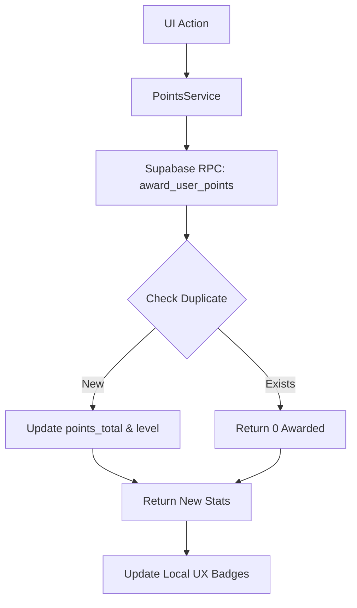

# Developer Guide: Points & Leaderboard Ready Reckoner

This guide serves as the technical reference for the **FUZO Points Engine** — the gamification layer that tracks user engagement and culinary status.

---

## 🏗️ Technical Root
The points system is modularized within `src/features/points/`.

- **Persistence Service**: `src/features/points/services/pointsService.ts`
- **Leaderboard UI**: `src/features/profile/components/LeaderboardModal.tsx`
- **Hook Layer**: Used globally via `PointsService.awardActionPoints()`.

---

## 🧭 Intelligence Architecture

The points system is **Server-Authoritative**. All math calculations (point awarding, level capping, and duplicate detection) occur inside a Postgres RPC function to ensure data integrity and prevent frontend manipulation.

### 1. The Awarding Pipeline
When a user performs an action (e.g., Saves a Snap), the app calls:
```tsx
await PointsService.awardActionPoints({ 
  actionType: 'snap_post',
  sourceEntityId: 'SNAP_UUID' 
});
```
This triggers the `award_user_points` RPC in Supabase.

### 2. The Duplicate Engine
To prevent "farm points" behavior, the system tracks specific action-source pairs. If a user tries to "Save" the same item 10 times, the `was_duplicate` flag becomes true and 0 points are awarded after the first instance.

---

## 🌳 Logic & Data Flow



---

## 💾 Database Integration

The system primarily updates the **`public.users`** table and logs activity in **`public.points_ledger`**.

### `public.users` Gamification Columns
| Column | Type | Description |
| :--- | :--- | :--- |
| `points_total` | `integer` | Cumulative points earned. |
| `points_level` | `integer` | Scalar level (incremented by RPC logic). |
| `last_point_at` | `timestamp`| Used for "Cool-down" logic in future releases. |

---

## 📡 Leaderboard & Ranking

### Rank Calculation (`getUserRank`)
The system calculates a user's relative position on-the-fly using a `GT` (Greater Than) count query against other users' `points_total`. This avoids the need for a separate `ranks` table.

### Filtered Leaderboards
The `getFilteredLeaderboard` method support three high-fidelity views:
1. **Global**: Full world ranking.
2. **Friends**: Filtered by active `crew` member IDs.
3. **Local**: Filtered by user `location_city` (ilike search).

---

## 🛠️ Maintenance & Modification

### Adjusting Action Values
To change how many points a 'share' or 'save' is worth, you must edit the **`award_user_points` SQL function** in the Supabase Dashboard SQL Editor (not in the frontend).

### Adding a New Action
1. Add the action ID to the `PointsActionType` enum in `pointsService.ts`.
2. Update the RPC logic in Supabase to recognize the new action and assign it a point value.

---

> [!IMPORTANT]
> **Points vs Cash**: Points are an engagement metric and are NOT mapped to real-world currency. For point-based redemptions (Rewards), the system decrements the `points_total` but preserves the `points_level`.

> [!TIP]
> **Performance**: Leaderboard queries are limited to 50 items by default. For larger datasets, use the pagination params in `getLeaderboard`.
