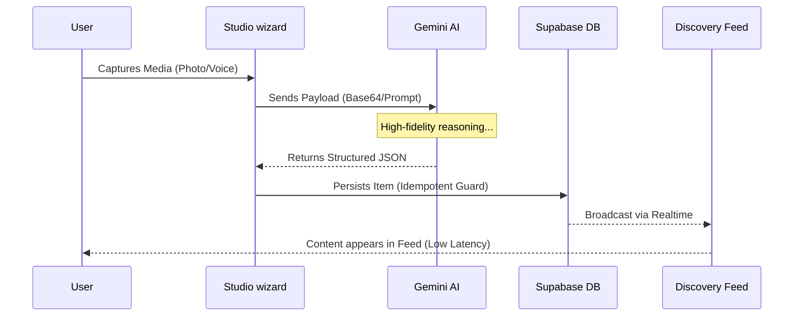

# Developer Guide: Project Architecture Ready Reckoner

This guide details the high-level orchestration, state management, and design system tokens used to power the FUZO V2 application.

---

## 🗺️ Macro Orchestration
The FUZO V2 ecosystem follows a synchronized 4-layer stack designed for rapid ingestion and intelligent discovery.

```mermaid
graph LR
    subgraph "Ingestion (Studios)"
        A[Camera/Voice] --> B{AI Studio}
        A2[YouTube/URL] --> B2{Link Studio (Zero-LLM)}
    end

    subgraph "Neural Synthesis & Heuristics"
        B --> C[Gemini AI: Visual/Text Extraction]
        B2 --> C2[Local Heuristics: Metadata Match]
    end

    subgraph "Persistence (Supabase)"
        C & C2 --> F[Postgres / Metadata]
        F --> G[Real-time Presence]
    end

    subgraph "Discovery (Feed)"
        G --> H{Scoring Engine}
        H --> I[Personalized Discovery Feed]
    end

    style A fill:#FACC15,stroke:#000,stroke-width:2px
    style B fill:#000,color:#fff,stroke:#FACC15,stroke-width:2px
    style I fill:#FACC15,stroke:#000,stroke-width:2px
```

## 🧪 Service Integrity: The Neural Lifecycle
Every user-generated action travels through an idempotent neural pipeline to ensure data fidelity.



---

## 🏗️ Root Orchestration
The application is bootstraped via `index.tsx`, which serves as the central hub for state and routing.

### 1. Global State Management
The root `App` component manages several critical state vectors:
- **Authentication**: `isAuthenticated`, `authUser`, and `authBooting` (handled via `AuthOrchestrator`).
- **Onboarding**: `hasCompletedOnboarding` determines if the user sees the landing experience or the active app.
- **Navigation**: `tab` state controls the active view based on `TAB_IDS`.
- **Modals**: Global boolean states for ephemeral views (`showSnap`, `showNotifications`, `showUnifiedCreation`, etc.).

### 2. View Rendering logic
The `App` component uses `renderAppView` (from `src/app/routes/renderAppView.tsx`) to switch between features based on the `tab` state.

---

## 🧭 Navigation Architecture
Navigation is split into two primary layers defined in `src/app/layout/navItems.ts`:

- **Active Hub (Bottom Nav)**: The high-frequency discovery tools (Feed, Bites, Snap, Trims, Scout).
- **Control Cluster (Drawer)**: Personal and social management (Profile, Leaderboard, Rewards, Chat, Notifications, Chef, Settings).

### Deep Linking
The app supports `?view=ID` query parameters. The `useTabUrlSync` hook ensures the browser URL stays in sync with the internal `tab` state for sharing and back-button support.

---

## 🎨 The "Masterclass" Design System
FUZO follows a premium, high-fidelity design language characterized by high contrast and extreme geometry.

### 1. Color Palette (Tailwind Tokens)
- **Primary Yellow**: `#FACC15` (Yellow-400) - Highlights, status badges, and "Neural" glows.
- **Foundation White**: `#FFFFFF` - Surface and card backgrounds.
- **Canvas Stone**: `#FAF9F6` (Stone-50) - Page background for light mode.
- **Pitch Black**: `#000000` - High-contrast text, iconography, and dark-mode frames.

### 2. Typography
- **Core Font**: Inter (System Sans-Serif).
- **Heading Style**: `font-black` (900 weight) + `uppercase`.
- **Badges**: Tracking is often set to `tracking-widest` (0.1em to 0.4em) for a high-end editorial feel.

### 3. Geometry & Effects
- **Global Radius**: Multi-scale approach.
    - Standard Card: `rounded-[2rem]`
    - Feature Modals: `rounded-[3rem]`
    - Mobile Pill Nav: `rounded-full`
- **Glassmorphism**: Combine `bg-white/80` or `bg-stone-900/60` with `backdrop-blur-xl`.
- **Borders**: Subtle `border-stone-100` for grouping; thick `border-white/ border-4` for "Stacked" UI effects.

---

## 🧭 Developer Onboarding Path
To get up to speed with the FUZO V2 engine, follow this reading sequence:
1.  **Project Architecture** (This guide) — Understand the root orchestration.
2.  **Auth & Onboarding** — Learn how users enter the high-fidelity ecosystem.
3.  **AI Studio Core** — Understand the shared wizard and neural synthesis logic.
4.  **Feature Reckoners** — Deep dive into specific modules (Feed, Snap, Scout, etc.).

---

## 📚 Technical Ready Reckoner Index
Below is the complete roadmap of architectural deep-dives for every feature:

### Core Ecosystem
- [Project Architecture](file:///k:/H/DRIVE/Quantum/Climb/APPS/FUZO_V2/docs/GUIDES/PROJECT_ARCHITECTURE_READY_RECKONER.md)
- [Auth System](file:///k:/H/DRIVE/Quantum/Climb/APPS/FUZO_V2/docs/GUIDES/AUTH_READY_RECKONER.md)
- [Multi-Path Onboarding](file:///k:/H/DRIVE/Quantum/Climb/APPS/FUZO_V2/docs/GUIDES/ONBOARDING_READY_RECKONER.md)
- [Settings & Profile Sync](file:///k:/H/DRIVE/Quantum/Climb/APPS/FUZO_V2/docs/GUIDES/SETTINGS_READY_RECKONER.md)

### Immersive AI Studios
- [AI Studio Core](file:///k:/H/DRIVE/Quantum/Climb/APPS/FUZO_V2/docs/GUIDES/AI_STUDIO_CORE_READY_RECKONER.md) (Shared Syntax)
- [Snap Studio](file:///k:/H/DRIVE/Quantum/Climb/APPS/FUZO_V2/docs/GUIDES/SNAP_STUDIO_READY_RECKONER.md) (Photo/Maps)
- [Bites Studio](file:///k:/H/DRIVE/Quantum/Climb/APPS/FUZO_V2/docs/GUIDES/BITES_STUDIO_READY_RECKONER.md) (Voice/Recipe)
- [Trims Studio](file:///k:/H/DRIVE/Quantum/Climb/APPS/FUZO_V2/docs/GUIDES/TRIMS_STUDIO_READY_RECKONER.md) (Video/YouTube)

### Engagement & Discovery
- [Discovery Feed](file:///k:/H/DRIVE/Quantum/Climb/APPS/FUZO_V2/docs/GUIDES/FEED_READY_RECKONER.md) (Algorithm & Idempotency)
- [Scout (Map Vision)](file:///k:/H/DRIVE/Quantum/Climb/APPS/FUZO_V2/docs/GUIDES/SCOUT_TECHNICAL_READY_RECKONER.md)
- [Chef AI](file:///k:/H/DRIVE/Quantum/Climb/APPS/FUZO_V2/docs/GUIDES/CHEF_READY_RECKONER.md)
- [Chat & Crew](file:///k:/H/DRIVE/Quantum/Climb/APPS/FUZO_V2/docs/GUIDES/CHAT_READY_RECKONER.md)
- [Points & Ranking](file:///k:/H/DRIVE/Quantum/Climb/APPS/FUZO_V2/docs/GUIDES/POINTS_SYSTEM_READY_RECKONER.md)
- [Rewards Portfolio](file:///k:/H/DRIVE/Quantum/Climb/APPS/FUZO_V2/docs/GUIDES/REWARDS_READY_RECKONER.md)
- [Notifications Drawer](file:///k:/H/DRIVE/Quantum/Climb/APPS/FUZO_V2/docs/GUIDES/NOTIFICATIONS_READY_RECKONER.md)

---

> [!TIP]
> **Orchestration**: Most features are passed `onSave` or `onShareRequest` callbacks from the root `index.tsx` to handle cross-feature persistence and communication while maintaining modularity.
