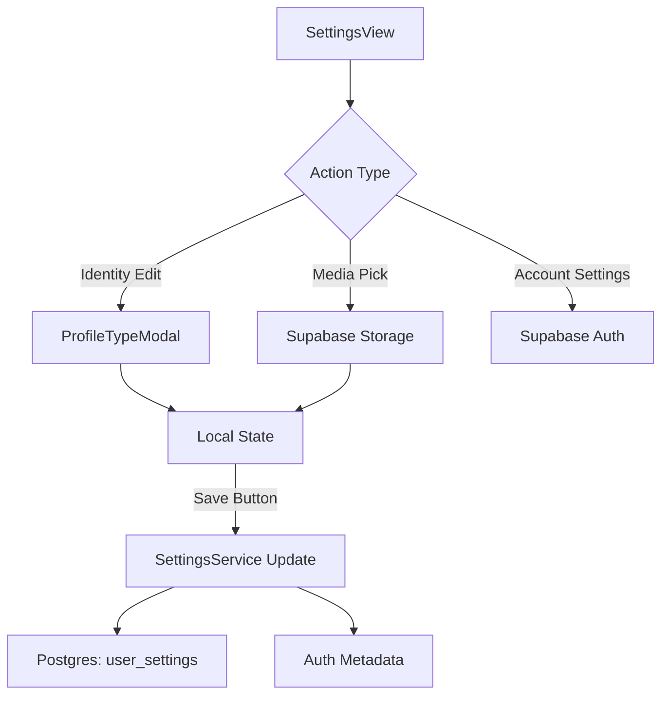

# Developer Guide: Settings Ready Reckoner

This guide serves as the technical reference for the **FUZO Settings Engine** — the module managing user identity, account security, and global preferences.

---

## 🏗️ Technical Root
The settings logic is modularized within `src/features/settings/`.

- **Main entry point**: `src/features/settings/components/SettingsView.tsx`
- **Persistence Service**: `src/features/settings/services/settingsService.ts`
- **Identity Modals**: `src/features/settings/components/ProfileTypeModal.tsx`

---

## 🧭 System Architecture

The Settings module operates as a bi-directional sync engine between the local UI state and two different data layers: Supabase Auth (for basic profile info) and the `public.user_settings` table (for custom application preferences).

### 1. The Persistence Loop
- **Mount**: `SettingsView` loads data from `SettingsService.getUserSettings()`. 
- **Local Edit**: State is managed via the `profile` object. The UI marks the form as `dirty` only when changes occur.
- **Sync**: `handleSaveSettings()` performs a bulk update to the Postgres table and concurrently updates the `user_metadata` in Supabase Auth to ensure consistency.

### 2. Media Upload Pipeline
The system supports async multi-asset uploads for Avatars and Cover Photos.
- **Bucket**: `avatars`
- **Pathing**: `[user_id]/[timestamp]-[filename]`
- **Logic**: `SettingsService.uploadUserMedia()` handles the raw file upload, generates a public URL, and returns it to the view for temporary preview before the final "Save Settings" commit.

---

## 🌳 Data Flow Diagram

---

## 💾 Database Integration

### `public.user_settings` Table
This table stores application-specific metadata that is too large or too variable for the Auth metadata object.

| Table Column | Mapping | Purpose |
| :--- | :--- | :--- |
| `id` | `user_id` | Primary Key (matches Auth UUID). |
| `bio` | `profile.bio` | User biography text. |
| `instagram` | `profile.instagram` | Social URL override. |
| `cuisine` | `profile.cuisine` | Preferred discovery tags. |
| `profile_type`| `profile.profileType`| 'Chef', 'Individual', etc. |

---

## 📡 Security & Account Actions

The Settings module wraps high-frequency account actions from the `supabaseClient`:
- **Password Transformation**: `handleChangePassword()` enables direct password rotation via prompt.
- **Email Recovery**: `handleSendPasswordReset()` triggers the recovery email flow with a specific redirect URL for the V2 app.

---

## 🛠️ Maintenance & Scaling

### Adding a New Preference Field
1. Add the column to the `user_settings` table in the Supabase Dashboard.
2. Update the `SettingsProfile` type in `settings/types/settings.ts`.
3. Add a new `SettingsItem` in `SettingsView.tsx` and wire it to the `editField` helper.

### Performance Considerations
The `SettingsView` uses `useMemo` for default state construction to prevent unnecessary re-renders of the complex 500+ line component during heavy typing in the "Bio" or "Name" fields.

---

> [!IMPORTANT]
> **Auth Sync**: When updating information like `full_name` or `username`, the service MUST update the Auth metadata. This is because the navigation and feed layers read from the `authUser` object directly for performance, not the `user_settings` table.

> [!TIP]
> **Dirty State**: The "Save Settings" button is disabled by default and only activates when `isDirty` is true. This prevents unnecessary round-trips to the DB.
