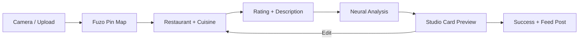

# Developer Guide: Snap Studio Ready Reckoner

This guide serves as a comprehensive technical reference for the **Snap Studio** feature — a 7-step immersive wizard for creating culinary discovery cards with AI-powered autotagging.

---

## 🏗️ Technical Root
The feature is fully modularized within `src/features/snap/`.

- **Main Entry Point**: `src/features/snap/components/SnapView.tsx`
- **Feature Export**: `src/features/snap/index.ts`
- **Persistence Layer**: `src/features/snap/services/snapPersistence.ts`
- **Shared Helpers**: `src/shared/lib/studioHelpers.ts` (shared across Snap, Bites, Trims)
- **Taxonomy**: `src/shared/utils/taxonomy.ts` (tag normalization + keyword map)

---

## 🧭 Sequential Wizard Architecture

The Snap wizard is a **full-screen modal** with 7 steps rendered inside a single orchestrator (`SnapStudio`). Each step is a standalone component:

| Step | Name             | Component           | Description                                      |
|:----:|:-----------------|:---------------------|:-------------------------------------------------|
|  0   | **Source**        | *(inline in SnapStudio)* | Camera viewfinder or file upload                 |
|  1   | **Location**      | `LocationPinStep`    | Interactive Google Map with draggable "Fuzo Pin" |
|  2   | **Identity**      | `IdentityStep`       | Restaurant name + cuisine grid selector          |
|  3   | **Story**         | `ExperienceStep`     | Star rating + free-text description              |
|  4   | **Reveal**        | `NeuralRevealStep`   | 2.5s animated loading (AI processing)            |
|  5   | **Review**        | `ReviewStep`         | Studio Card preview with Edit/Publish actions    |
|  6   | **Finish**        | `SuccessStep`        | Confirmation + optional "Post to Feed" CTA       |

### Flow Diagram

---

## 🧠 Hybrid Autotagging Pipeline

Snap uses a **dual-pass** tag extraction system triggered at step transition 3→4:

### Pass 1: Local Keyword Matching
- File: `SnapView.tsx` → `extractLocalTags()`
- Uses `TAXONOMY_KEYWORD_MAP` from `taxonomy.ts`
- Regex-free substring search against user description
- Returns normalized tags instantly (no API call)

### Pass 2: Gemini 1.5 Flash
- Calls `GeminiService.generateContent()` with a structured JSON prompt
- Extracts: `cuisine`, `dietary`, `meal_type`, `ambience`, `features`, `price_range`, `creative_tags`
- Response is parsed via `parseAiJson()` (handles code fences and malformed JSON)
- Results are merged with Pass 1 tags, deduplicated, and normalized via `normalizeTag()`

> [!IMPORTANT]
> The `TAXONOMY_KEYWORD_MAP` in `taxonomy.ts` is the source of truth for all local tag extraction. When adding new tags, always update the keyword map there — the Gemini pass will handle new concepts automatically.

---

## 💾 Persistence — The Triple Write

When a Snap is confirmed (`handleFinish`), `persistSnapData()` in `snapPersistence.ts` performs:

1. **Storage Upload**: Image → Supabase Storage bucket `snaps` → returns public URL
2. **Posts Table**: Creates a feed-visible social post in `public.posts`
3. **FUZO Locations**: Inserts into `public.fuzo_locations` (the Scout map dataset)
4. **Saved Items**: Persists to `public.saved_items` via `PlateService.saveToPlate()`

### Optional: Feed Syndication
If user clicks **"Post to Feed"** on the Success screen, `FeedService.publishToFeed()` inserts into `public.fuzo_feed` with type `'photo'`.

---

## 🗄️ Database Tables

| Table             | Role                                    | Key Columns                        |
|:------------------|:----------------------------------------|:-----------------------------------|
| `posts`           | Social post (feed content)              | `user_id`, `content`, `image_url`  |
| `fuzo_locations`  | Global Fuzo Pin dataset (Scout map)     | `source_snap_id`, `restaurant_name`, `latitude`, `longitude` |
| `saved_items`     | User's personal Plate collection        | `item_type: 'photo'`, `item_id`   |
| `fuzo_feed`       | AI Discovery Feed syndication           | `type: 'photo'`, `metadata` (JSONB) |

---

## 📡 External API Dependencies

| Service               | Usage in Snap                            | Config Key                     |
|:----------------------|:-----------------------------------------|:-------------------------------|
| **Google Maps JS**    | Map rendering, marker, reverse geocoding | `VITE_GOOGLE_MAPS_API_KEY`     |
| **Google Places**     | Nearby place search (auto-address)       | Proxied via Supabase Edge Fn   |
| **Gemini 1.5 Flash**  | Neural tag extraction                    | `VITE_GEMINI_API_KEY`          |
| **Supabase Storage**  | Image upload to `snaps` bucket           | `VITE_SUPABASE_URL` / `ANON_KEY` |

---

## 🛠️ Modification Processes

### Adding a New Wizard Step
1. Create a new step component in `SnapView.tsx` following the existing pattern (full-screen, fixed inset, z-250).
2. Add the step name to the `STUDIO_STEPS` array inside `SnapStudio`.
3. Wire the step in the `currentStep` switch block and adjust Next button step increments.

### Adding New Autotagging Categories
1. Add keywords to `TAXONOMY_KEYWORD_MAP` in `src/shared/utils/taxonomy.ts`.
2. Update the Gemini prompt in `handleNeuralAnalysis()` to include the new bucket.
3. Add the bucket results to the `combinedTags` merge array.

### Changing the Map Style
Edit the `styles` array inside `LocationPinStep`. The current map uses a dark theme (`#1c1c1c` landscape, `#000000` water).

### Adjusting the Neural Loading Duration
The `NeuralRevealStep` auto-advances after 2500ms. Change the timeout value in the `useEffect` inside that component.

---

## ⚠️ Known Considerations

> [!WARNING]
> **Camera Permission**: If the user denies camera access, the wizard gracefully falls back to file upload only. There is no explicit error UI for this — consider adding a prompt.

> [!TIP]
> **Geolocation**: The wizard requests high-accuracy positioning on Step 0. If denied, the Location Pin step defaults to NYC (40.7128, -74.0060). This is a sensible fallback but could be improved with IP-based geolocation.

> [!NOTE]
> **Shared Helpers**: `parseAiJson`, `readImageFileAsDataUrl`, and `loadUploadedImage` live in `src/shared/lib/studioHelpers.ts` because they are reused by the Bites and Trims AI studios.
